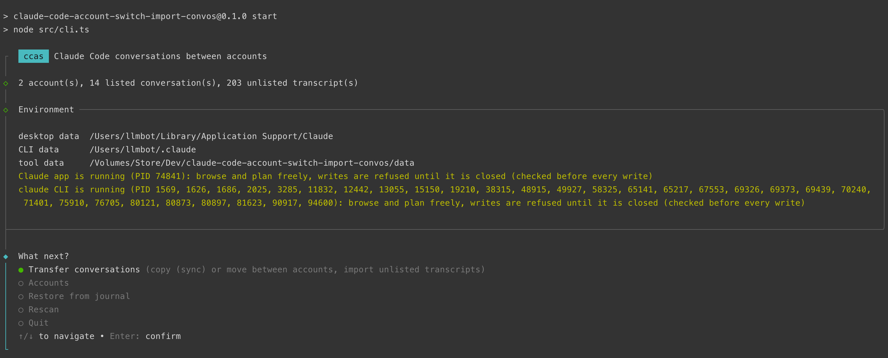

# ccas: move Claude Code Desktop conversations between accounts



A macOS tool that copies or moves conversations from the Code tab of the Claude desktop app between signed-in accounts. It works on the files the app keeps on disk, has a text interface (TUI) and a command mode for scripts. Every operation leaves a backup and a journal entry, and can be undone.

## Quick start

Copy every conversation of one account to another, leaving out the ones you choose. Before you run it:

- quit the Claude app with Cmd+Q and end every `claude` session in the terminals of this Mac
- use Terminal.app, not the terminal built into Claude
- do the one-time setup first (see "Setup after cloning")
- if some conversations run over SSH, `ssh -o BatchMode=yes <host> true` must work without a prompt

The first line only shows the plan (dry run), the second one copies:

```bash
cd <repo dir> && nvm use >/dev/null && npm start -- transfer --from <source> --to <target> --mode copy --all --exclude <id-1> --exclude <id-2> --dry-run
```

```bash
cd <repo dir> && nvm use >/dev/null && npm start -- transfer --from <source> --to <target> --mode copy --all --exclude <id-1> --exclude <id-2>
```

Then start the Claude app, switch to the target account and look at the Code tab.

| Placeholder | What to put there |
|---|---|
| `<repo dir>` | the directory of this repository |
| `<source>` | the account you copy from: its e-mail, a name given in ccas, or the start of its account uuid (`npm start -- accounts` lists them) |
| `<target>` | the target account, in the same form |
| `<id-1>`, `<id-2>` | conversations to leave out: the id from the `id` column of `npm start -- list --from <source>`; the first six characters are enough |
| `<host>` | the host of SSH conversations, as the app has it (for example `user@mini.local` or an alias from `~/.ssh/config`) |

You can leave out any number of conversations (one `--exclude` each), or none.

## Setup after cloning

Requirements: macOS with nvm. The Claude app may stay open while you browse and plan. To apply changes it must be quit (Cmd+Q), and no `claude` process may run, not even in a terminal.

1. Go to the repository directory.

```bash
cd claude-code-account-switch-import-convos
```

2. Install Node 24, if nvm does not have it yet.

```bash
nvm install 24
```

3. Switch to Node 24 (nvm reads `.nvmrc`).

```bash
nvm use
```

4. Install the dependencies exactly as `package-lock.json` pins them.

```bash
npm ci
```

5. Start the interface.

```bash
npm start
```

Expected: the `ccas` header, a progress spinner while transcripts are read, an "Environment" box with the `~/Library/Application Support/Claude` path of this machine and the state of the app and the CLI, then the menu.

There is no build step: Node 24 runs the TypeScript sources directly. The tool's own data (`data/`: accounts, lineage, journal, backups, cache) is created on the first run inside the repository directory. It is ignored by git and must be separate for every machine.

## Copying conversations from one account to another, step by step

This copies all conversations of one account to another, except the ones you leave out. The placeholders are the ones from the table in "Quick start".

### Before you start (both ways)

1. Quit the Claude app with Cmd+Q; closing its window is not enough.
2. End every `claude` session in the terminals of this Mac. SSH sessions that run on another computer do not get in the way, because their CLI runs there.
3. Open Terminal.app. Do not use the terminal built into Claude: it closes together with the app.
4. Go to the repository:

```bash
cd <repo dir>
```

5. Switch to Node 24:

```bash
nvm use
```

6. Check that nothing runs:

```bash
node -e "import('./src/app-guard.ts').then(async m => console.log(JSON.stringify(await m.detectClaudeProcesses(require('node:os').homedir() + '/.claude'), null, 2)))"
```

   Expected: `"status": "not-running"` for `Claude` and for `claude`. A `claude` entry that mentions "from its session file" names a CLI session the CLI's own index still lists (see "Safety"); quit that session, or, when it crashed earlier, start and quit `claude` once so the CLI clears the leftover.

7. If some of the conversations run over SSH, check that the host answers without asking anything:

```bash
ssh -o BatchMode=yes <host> true
```

   Expected: the command ends without any output. On `Permission denied`, add your key to the agent (`ssh-add`). On `Host key verification failed`, connect once with plain `ssh <host>` and accept the host key.

### Way A: one command (recommended)

1. Do a dry run. Nothing is written, you only see the plan:

```bash
npm start -- transfer --from <source> --to <target> --mode copy --all --exclude <id-1> --exclude <id-2> --dry-run
```

   Expected: `[dry-run] excluded "..."` lines for the conversations left out, `[dry-run] created "..."` for the others (for SSH conversations followed by `transcript also on <host>`), and at the end `[dry-run] summary: ... created, 0 updated, 0 up to date, 0 skipped, 2 excluded, 0 failed`.

2. Copy for real:

```bash
npm start -- transfer --from <source> --to <target> --mode copy --all --exclude <id-1> --exclude <id-2>
```

   Expected at the end: `summary: ... created, 0 updated, 0 up to date, 0 skipped, 2 excluded, 0 failed`, with the same number of `created` as in the dry run.

3. Start the Claude app, switch to the target account and check in the Code tab that the conversations have the same titles, SSH host and archive state.

The two lines in "Quick start" do the same from any directory.

### Way B: the TUI

In the TUI you pick conversations by title. Before the list it asks for the scope, so all conversations (or all but a few) take a single choice.

1. Find the titles of the conversations to leave out. The dry run of way A shows them as `excluded "<title>"`:

```bash
npm start -- transfer --from <source> --to <target> --mode copy --all --exclude <id-1> --exclude <id-2> --dry-run
```

2. Start the TUI:

```bash
npm start
```

   Expected: an "Environment" box saying "Claude app is not running" and "claude CLI is not running", then the menu.

3. Choose "Transfer conversations".
4. In "Source", choose the source account. When the account has a name given in ccas, the list shows the name and the e-mail is in the hint.
5. In "Target account", choose the target account.
6. In "Which conversations to transfer to ...?", choose "All except the ones I pick". When you leave nothing out, choose "All N conversations" and go on with step 9.
7. In the list, select the conversations from step 1:
   - the up and down arrows move the cursor
   - Space or Tab selects and unselects a conversation
   - typing filters the list by title, Backspace removes the filter text
8. Press Enter.
9. In "Operation", choose "Copy (sync)".
10. Read the "Plan" box.

    Expected: one `[dry-run] created "..."` line for every chosen conversation (for SSH conversations followed by `transcript also on <host>`).

11. Answer Yes to "Apply N operations?".

    Expected: a "Result" box with a `created` line for every conversation.

12. Choose "Quit".
13. Start the Claude app, switch to the target account and check the Code tab.

### When something goes wrong

| What you see | What it means | What to do |
|---|---|---|
| `refused: Claude Code is running: ...` (exit code 2) | the app or some `claude` process runs; the message lists the PIDs | quit what the message lists and run again |
| `Could not tell whether Claude Code is running` (exit code 2) | the process list cannot be read | run the tool in Terminal.app, not from a Claude Code session |
| `no account matches "..."` | the account was not recognised | run `npm start -- accounts` and give the start of the account uuid (at least four characters) |
| `"..." is ambiguous` or `no conversation matches "..."` | the id matches several conversations or none | run `npm start -- list --from <source>` and give a longer id (`local_...`) |
| exit code 4, `... interrupted ...` | an earlier run was cut short | `npm start -- restore <id>` undoes it, `npm start -- resolve <id>` keeps its files as they are |
| `FAILED` for some conversations (exit code 3) | those conversations were not copied, the rest were | read the reason on the `FAILED` line; `npm start -- restore <id>` with the `[journal <id>]` of that line cleans up what is left; running the command again finishes the copying, and conversations already copied report "up to date" |
| `FAILED ... could not reach <host> over ssh` | `ssh` cannot connect to the host without a prompt; nothing was written | do step 7 of "Before you start", then run the command again |
| `FAILED ... <host> has no transcript <id>.jsonl` | the original is not on the host (deleted, or another host), so a copy could not be resumed there; nothing was written | look at `~/.claude/projects` on the host; the original cannot be resumed either |
| `error: another ccas is running (PID ...)` (exit code 1) | a second ccas holds the lock on `data/` | wait for it, or remove `data/lock` when that process is gone |
| `warning: the Claude app is X, newer than Y, the version whose record fields this tool was checked against` | the app (or the CLI) was updated since this tool was last checked against it | copies still work; the `accounts` command lists record fields the tool does not know, see "Development" for how to check them |
| in the app, in a copied SSH conversation: "Claude couldn't process that message" and "Session history unavailable" | a copy made before 2026-09-28 has no transcript on the host | do not click "Start fresh"; quit the app and run the same copy command again (see "Repairing older copies") |
| you want to undo the copying | every conversation is a separate journal entry | `npm start -- journal` lists the entries, `npm start -- restore <id>` undoes one |

### Good to know

- Running the same command again is safe: copied conversations report "up to date" and nothing is duplicated. Copies made before 2026-09-28 get repaired on the way (`repaired`).
- Do not delete `data/lineage.json`: it is how the tool knows what it has copied already.
- Copies of SSH conversations are full conversations: you can continue them on the target account, on the same host. From the moment of copying, the original and the copy are independent.
- Copied and moved conversations have Remote Control switched off; you switch it on in the app, per conversation.
- A copy carries the conversation's checkpoints (`/rewind` works in it) and its Remote Control attachments, on this Mac and on the SSH host.
- Only one ccas writes at a time: the TUI, `transfer`, `restore` and `resolve` take a lock on `data/`; a dry run and the read-only commands do not.

## Commands

### Interactive mode

```bash
npm start
```

1. The start screen shows the directories in use and whether the app and `claude` processes run (for information). While Claude Code runs, every screen works up to the plan (a dry run), and applying is refused at the moment of writing. `npm start -- --dry-run` forces plans only, also with the app quit.
2. "Transfer conversations": choose the source (an account or "No account"), the target account and the scope ("All N conversations", "All except the ones I pick" or "Pick them one by one"). For the last two, pick conversations from a list with a filter; the hint column shows the state against the target, the origin, the project, the date and the size. Then choose the operation (Copy or Move), decide for conversations in the "target is newer" and "diverged" states, read the plan (a dry run, which reads the host for SSH conversations) and confirm.
3. "Accounts": the table of accounts, giving an account a name, and typing an e-mail by hand, only for an account whose address was not found.
4. "Restore from journal": undo a chosen operation.

After every operation that writes, start the Claude app again: it reads the records only at start-up.

### Command mode

| Command | What it does |
|---|---|
| `npm start -- --dry-run` | the TUI in rehearsal mode: every screen shows its plan and writes nothing |
| `npm start -- accounts [--json]` | accounts, e-mails, names |
| `npm start -- list --from <account\|none> [--to <account>] [--json]` | the conversations of the source; with `--to` also their state against the target |
| `npm start -- transfer --from <account\|none> --to <account> --mode copy\|move --session <id> [--session <id> ...] [--on-conflict skip\|overwrite] [--dry-run]` | runs the operation on the conversations named |
| `npm start -- transfer --from <account\|none> --to <account> --mode copy\|move --all [--exclude <id> ...] [--on-conflict skip\|overwrite] [--dry-run]` | runs the operation on every conversation of the source except the excluded ones |
| `npm start -- journal [--json]` | the operation journal |
| `npm start -- restore <journalId> [--dry-run]` | undoes an operation |
| `npm start -- resolve <journalId>` | keeps the files of an interrupted operation as they are (see "Interrupted operations") |

An account is named by its name, its e-mail, the `accountId/orgId` pair, its account uuid, or a prefix of the account uuid (at least four characters). A conversation is named by its record id (`local_...`), its CLI session id or the uuid of the first transcript line, or by a prefix of at least six characters of any of them.

`--all` takes every conversation of the source, and `--exclude` (repeatable) leaves out the ones named. Every `--exclude` must match exactly one conversation, by the same rules as `--session`. A typo or an ambiguous prefix ends with exit code 1 before anything is written. The same conversation named twice counts once. Nothing else is merged: two conversations are always two entries. `--all` together with `--session`, `--exclude` without `--all`, and neither of the two are usage errors.

The output of `transfer` is, in order: the `excluded` lines, one result line per conversation, a reminder to start the app, and a summary at the end:

```
summary: 31 created, 0 updated, 0 up to date, 0 skipped, 2 excluded, 0 failed
```

The six counts always appear; `repaired`, `moved` and `refused` are added when there are any.

Global options: `--user-data <dir>` (the app's data), `--claude-dir <dir>` (the CLI directory, by default `CLAUDE_CONFIG_DIR` or `~/.claude`), `--data <dir>` (the tool's data, by default `data/` in this directory). With `--user-data` pointing at a copy of the app's directory you can rehearse operations safely: the block while Claude Code runs applies only to the real directory.

Environment variable `CCAS_SSH=<program>` replaces `ssh` for the SSH host steps (the tests use a stand-in, see "Development").

Exit codes:

| Code | Meaning |
|---|---|
| 0 | success |
| 1 | usage error or another error (also a selector that does not match exactly one conversation, or another ccas holding the lock) |
| 2 | writing refused: the app or a `claude` process runs (also when it appeared during the operation, which was then rolled back), or that could not be checked |
| 3 | part of a transfer failed |
| 4 | an interrupted operation needs `restore` or `resolve` |

## How the Claude app stores conversations

Found from the files on disk and the code of `Claude.app`:

| What | Where |
|---|---|
| the app's data (`userData`) | `~/Library/Application Support/Claude/` |
| records of Code conversations, per account | `userData/claude-code-sessions/<accountId>/<orgId>/local_<uuid>.json` |
| what the ids mean | the first level is the account uuid, the second the organization uuid (`lastKnownAccountUuid` in the app's `config.json` names the account) |
| transcripts (the content of conversations) | `~/.claude/projects/<encoded project dir>/<cliSessionId>.jsonl`, plus a sidecar directory `<cliSessionId>/` with tool results and sub-agent transcripts |
| local mirror of an SSH session | `~/.claude/projects/ssh-<cliSessionId>/<cliSessionId>.jsonl`, plus flat sub-agent files `agent-<hex>.jsonl` in the same directory |
| per-session directories outside `projects/` (documented by Claude Code under "Claude directory") | `~/.claude/file-history/<cliSessionId>/` (the pre-edit snapshots `/rewind` restores from), `~/.claude/uploads/<cliSessionId>/` (attachments of Remote Control sessions, referred to by path from the transcript), `~/.claude/image-cache/<cliSessionId>/`; for an SSH conversation they are on the host |
| the CLI's index of running sessions | `~/.claude/sessions/<pid>.json`, one file per running CLI process, removed when it exits; files of sessions that crashed stay until the next launch |

A record is a small JSON file (id, `cliSessionId`, project directory, title, dates, model, and about 160 further fields in Claude.app 2.19675.0). A transcript is a file with one JSON object per line, shared by all accounts, because the CLI has a single `~/.claude` directory. The app reads records only at start-up and when switching accounts, always fresh from disk, and writes them when they change and when it quits. It writes only the fields it knows: a field added by another tool is gone the first time the app saves the record. The app also promotes a file named `local_<uuid>.json.tmp` (younger than 30 days) to a record when the record is missing or unreadable, which is why this tool's temporary files never end in `.json.tmp`.

What the tool knows about these files was read from the files themselves and from the code of Claude.app 2.19675.0 and CLI 2.1.286 (checked 2026-10-05). Claude Code documents the transcript directory, the per-session directories and the session index, and says the line format is internal and changes between versions; the records, the SSH mirrors and the Remote Control lines in transcripts are not documented. The tool therefore warns when the installed app or CLI is newer than the versions it was checked against (see "Development").

Conversations driven from claude.ai through Remote Control, and sessions started from a terminal, have no record on any account, only a transcript. The tool shows them as the source "No account" and can import them.

## How the tool works

### Conversations and their copies

Every entry in the app's side panel is a conversation of its own, and the tool does not judge conversations: it does not check whether they are the same, similar, short, unfinished or odd. A conversation on the source and one on the target account count as an original and its copy only when an explicit link connects them:

1. they have the same record id (a record moved between accounts)
2. `data/lineage.json` recorded a link between them, in either direction (a transcript without a record is named there by its `cliSessionId`)
3. the `ccas` stamp of one record names the other

In every other case the conversation is new on the target account, even when it starts exactly like one there. A fork starts that way, for example: it is a conversation of its own and gets a copy of its own. The tool prints no remarks about similarity.

Content is compared only for a linked pair. Every message line of a transcript has a `uuid`, and a copy changes only the session id, so the ordered list of uuids tells whether the copy is up to date, behind, ahead of the source, or diverged.

### Copy (sync), Move, Import

| Operation | The target account has no copy | The target account has a linked copy |
|---|---|---|
| Copy (sync) | a copy is made with a new `sessionId` and a new `cliSessionId`, its own transcript, sidecar directory and per-session directories (for SSH: its own mirror, and its own transcript and per-session directories on the host) | the copy is brought up to date with the source (transcript, sidecar directory, per-session directories, record); the target keeps its ids |
| Move | the record file changes directory; ids and transcript stay as they are | as above, then the record, transcript, sidecar directory and per-session directories of the source go into the backup |
| Import (source "No account") | like Copy; the original transcript is not touched | like Copy |

Every operation switches Remote Control off in the conversation it transfers (see "Remote Control").

Copies get new ids on purpose: when it switches accounts, the app parks sessions by `sessionId`, so one id on two accounts could send a write to the directory of the wrong account.

Content and titles stay as they are. In the files of a copy the technical session id changes, and at the end of the transcript a line is added that ends the link to a claude.ai session (see "Remote Control"). A copy has the same title, the same SSH host and the same archive state as the original, and looks like a conversation held on the target account.

The record of a copy loses the fields that tie it to the live state of the source. The app does the same for its own fork:

| Group | Fields | Why |
|---|---|---|
| process on the SSH host | `sshRemoteProcessId`, `sshReattach`, `sshProcessLossStoodDownAt`, `sshKillRecoveryGrantedAt`, `sshForeignDaemonLossAt` | the app adopts that process or kills it; a copy would do that to the original's process |
| remote path | `sshRemoteTranscriptPath` | the app would sync the copy's mirror from the source's file and could empty it |
| SSH mirror sync | `sshRemoteProjectDir`, `sshLocalTranscriptSize`, `sshSubagentSyncedSizes` | byte offsets of the source's mirror; the app clears them itself whenever a session id changes, and a copy has a new one |
| claude.ai | `bridgeSessionIds`, `remoteControlSpawn`, `cloudSessionId` | the claude.ai sessions belong to the original |
| earlier transcripts | `priorCliSessionIds`, `unarchivedCliSessionId`, `preClearCliSessionId` | a copy has only its own transcript |
| sending on its own | `interruptedByQuitAt`, `interruptedUnseenResume`, `armedWorkAtQuit`, `pendingFirstStart` | the app would resume work or start a queued task by itself |
| the account itself (app 2.19675.0) | `emailAddress` | names the source account |
| claude.ai things of the source account | `publishedArtifacts`, `cloudSpawnedTasks`, `movedToCloud` | artifacts and cloud tasks live under that account on claude.ai |
| other sessions of the source account | `peerInbound`, `peerReceipts`, `dispatchParentId`, `dispatchParentOrigin`, `forkedFromSessionId`, `forkedAtMessageUuid`, `lineageDetached` | peers, the session that dispatched this one and the fork lineage all name records of the source account |
| the app's importer and index | `importedFrom`, `indexedAt`, `resumeConfirmed`, `stagedTranscriptPath`, `transcriptUnavailable` | history of the source with the app; a staged transcript path would make the app read the transcript from elsewhere |
| organization resources | `envScopeId`, `startedFromEnvironmentId`, `spaceId`, `scheduledTaskId`, `scheduledRunContinued` | cloud environments, spaces and scheduled tasks of the source's organization |

Every field the record serializer of Claude.app 2.19675.0 writes is in one of three lists in `src/records.ts`: dropped from copies (the table above), Remote Control (switched off, see below) or kept. A record field in none of them is reported by `accounts`, `list` and `transfer` ("fields this tool does not know"); it is most likely new in a newer app, and copies carry it as it is until the lists are updated.

The app's `waiting-input/` directory is not copied: restored for an SSH session, it could make the app send on its own.

Whether a conversation is archived is decided by the `isArchived` field of its record, which a copy keeps. The file `archived-sessions.idx` (`{"v":1,"archived":["local_..."]}`) is only a hint for the order the app loads records in; the app rewrites it itself, so the tool leaves it alone.

A record without a transcript is an entry in the side panel too. Copy then makes a copy of the record alone, with new ids and without the source-bound fields.

### Per-session directories

Besides the transcript, the CLI keeps three directories per session outside `projects/`, each named after the CLI session id: `file-history/<id>/` with the pre-edit snapshots `/rewind` restores from (without them a rewind ends with "No files were restored"), `uploads/<id>/` with the attachments a Remote Control session refers to by path, and `image-cache/<id>/`. A copy gets each of them that the original has, under its new id: on this Mac for a local conversation, on the host for an SSH conversation (next to the host's own, before the transcript is put in place). The files inside carry no session id, so they are copied as they are. An update replaces them (the old ones go into the backup), a move takes the source's along into the backup, and `restore` puts everything back.

Not copied, on purpose: `session-env/<id>` and `tasks/<id>` (state of a CLI process, not of the conversation), `debug/<id>.txt`, `dev-mods/<id>`, `history.jsonl` (the prompt history, which names sessions but belongs to the machine) and the scratchpad under `/private/tmp/claude-<uid>/`. The CLI deletes all of these together with the transcript after `cleanupPeriodDays` anyway.

### States

Before an operation the tool finds out whether the target account has a linked copy and compares the uuid lists of the pair:

| State | Meaning | What the tool does |
|---|---|---|
| new on target | the target has no linked copy | makes a copy |
| up to date | the uuid lists are identical | nothing, except repairing a copy made before 2026-09-28 (see "Repairing older copies"); Move then removes the source |
| update available | the copy is a prefix of the source, or it has no transcript (for example the app removed its `cliSessionId`) | updates the target |
| target is newer | the source is a prefix of the copy | skips; with "overwrite" chosen, overwrites the target |
| diverged | a common start, then both sides added lines | skips; with "overwrite" chosen, overwrites the target |
| linked copy holds another conversation | the linked copy has different content now, for example the app started a new session in it | skips, never overwrites |
| linked to several on target | several entries on the target are linked to the conversation | skips and prints their ids |
| no transcript | a record without a transcript file | Copy makes a copy of the record alone (when there is one already: "up to date", or a repair); Move moves the record alone |

For a linked pair the project directory, the record's creation time and the time of the first line are compared as well; a mismatch is shown as a warning.

### SSH sessions

A conversation in the Code tab can run on another computer over SSH. Its transcript then lives on that computer, and the app keeps a local mirror that only grows, from the remote side to the local one:

```
~/.claude/projects/ssh-<cliSessionId>/<cliSessionId>.jsonl
~/.claude/projects/ssh-<cliSessionId>/agent-<hex>.jsonl
```

The app finds the mirror by the record's `cliSessionId`. A copy therefore gets its own `ssh-<new id>/` directory with the transcript and every sub-agent file, the id replaced, and the permission bits of the source (0700 for the directory, 0600 for the files). The copy's record keeps `sshConfig` (the same host), the title, `isArchived`, `lastAssistantUuid`, `spawnedFrom` and every field not in the table above.

The mirror is for display only. The conversation is run by the CLI on the host: whenever the app starts it (when you send a message, but also by itself when you come back to the conversation), it runs `--resume <cliSessionId>` there. So a copy also gets its own transcript on the host, next to the original, the way the app does it for its own fork of an SSH conversation:

```
<host>:~/.claude/projects/<encoded dir>/<new id>.jsonl   the original's transcript with the id replaced, ending with a line that switches Remote Control off
<host>:~/.claude/projects/<encoded dir>/<new id>/        the original's sidecar directory, with the id replaced in names and in .json/.jsonl files
<host>:~/.claude/file-history/<new id>/                  the original's per-session directories, copied as they are (also uploads/ and image-cache/)
```

Without that transcript the CLI on the host fails with "No conversation found with session ID", the app shows "Claude couldn't process that message" and "Session history unavailable", removes the `cliSessionId` from the copy's record, and the history disappears from view. That is what happened to copies made before 2026-09-28.

How it works:

- The tool connects to the host with the system `ssh` and the values from `sshConfig` (host, port, key), in batch mode (`BatchMode=yes`). `ssh <host> true` must work in Terminal.app without asking for a password: the key in the agent, the host key known.
- On the host it runs an `sh` script given on standard input (`sh -s`), so the host's login shell has nothing to interpret. The original is found by its id under `~/.claude/projects` on the host (or under `CLAUDE_CONFIG_DIR`).
- The copy on the host is made by replacing the id in the host's original, byte for byte. The app extends a mirror with the bytes of the host file past the mirror's length, so a mirror must be an exact prefix of the host file. The copy's mirror is made from the original's mirror, which is a prefix of the original on the host, and the id has a fixed length, so this holds. Whatever the host has beyond the mirror reaches the mirror with the next sync.
- Everything is built under temporary names first; the per-session directories go into place before the sidecar directory, and the transcript last, under a name that cannot exist yet (`ln`), so the CLI cannot resume the copy before everything it refers to is complete.
- The host name and key path from the record, and every path the host reports back, are checked before they reach `ssh` or a script (a host name never starts with `-`, a reported path is absolute and free of control characters).
- A dry run connects to the host too, but only reads.
- When the host cannot be reached or does not have the original, the copy of the SSH conversation is not made: the operation is rolled back and reported as `FAILED` with the reason. A copy that would break the first time it is used is never made.
- Changes on the host are journaled like local ones. `restore` sets created files aside as `<file>.ccas-removed-<id>`, and replaced ones (after an update) come back from `<file>.ccas-backup-<id>`. The CLI ignores names that do not end in `.jsonl`. Nothing on the host is deleted.

Checked against the real CLI 2.1.281 on a host: for a random id, `--resume` fails with "No conversation found with session ID", and a copy made by this script starts as a session with the copy's id.

### Remote Control

A conversation driven or followed from claude.ai (Remote Control) is linked to a claude.ai session of the account it ran under. Copying and moving switch that link off, because the claude.ai session belongs to the source account:

| Where | What changes |
|---|---|
| record | `bridgeSessionIds`, `cloudSessionId`, `remoteControlSpawn`, `remoteControlDescendant`, `remoteControlAutoEligible`, `remoteControlUserRequested`, `remoteControlStartChoice` and `steeredByRemoteClient` are removed; `remoteControlUserEnabled` becomes `false` and `remoteControlUserToggled` `true`, which is what the app itself records for a conversation started without Remote Control |
| transcript | a line `{"type":"bridge-session","sessionId":"<id>","bridgeSessionId":"","lastSequenceNum":0}` is added at the end for every live link; the CLI writes the same line when Remote Control is switched off, and the app does when it forks |

The app then does not switch Remote Control on by itself. You can switch it on in the app, and the conversation is linked to a new claude.ai session of the account it is on now.

Transcripts of SSH conversations get that line on the host (the mirror picks it up), because the local mirror must stay a prefix of the host file. When an SSH conversation is moved and the host cannot be reached, you get a warning: the record has Remote Control off, and the transcript line matters only once it is switched on again. A CLI process that still runs on the host keeps its link until it ends.

`restore` brings the record back from the backup, and with it the earlier Remote Control state. The lines added to a transcript on the host stay (the output of `restore` warns about that).

### Repairing older copies

Copies made before 2026-09-28 have no transcript on the host and carry the Remote Control state of their source. Running the same copy command again is enough: for copies in the "up to date" state the tool adds what is missing and reports `repaired`:

```
repaired "<title>" on <target>: Remote Control switched off; transcript created on <host> [journal <id>]
summary: 0 created, 0 updated, 0 up to date, 0 skipped, 2 excluded, 0 failed, 31 repaired
```

- Remote Control is switched off only where the copy still has the source's state: record fields equal to the source's, and links to the source's claude.ai sessions. If you switch Remote Control on in a copy after copying, later runs do not undo that.
- A copy whose `cliSessionId` the app removed after a failed resume ("Session history unavailable"), but in which no new session was started, is in the "update available" state. It gets its old id back (from `data/lineage.json`), a fresh mirror and a transcript on the host.
- A copy in which "Start fresh" was clicked after the error holds a new conversation now. Its state is "linked copy holds another conversation", and it is left alone.
- Every repair is a separate journal entry and can be undone with `restore`.

### Origin of a conversation

| Label | Criterion |
|---|---|
| desktop | a record and a transcript, without `bridge-session` lines |
| remote-control | a record and a transcript with `bridge-session` lines (the owner on the claude.ai side is shown; "adopted" when the owner differs from the record's account) |
| claude.ai | a transcript without a record, with `bridge-session` lines |
| desktop, unlisted | a transcript without a record, run by the CLI of the desktop app |
| terminal | a transcript without a record, run from a terminal |
| unknown | a transcript without an origin marker |

Flags: `archived`, `no transcript`, `adopted`. The tool does not guess whether a conversation is still going on. Whether writing is allowed depends only on whether Claude Code runs (see "Safety").

### Accounts and e-mails

The app does not store the e-mail next to the account directory. The tool finds it from three sources, in this order:

1. `~/.claude.json`, the `oauthAccount` block (account uuid, organization uuid, e-mail, organization name), for the account the CLI is signed in to. Only these four fields are read from that file. The organization name tells apart two directories of the same e-mail in two organizations.
2. `session_context` lines in the transcripts of the account's sessions (newer CLI versions write the user's e-mail there). Sessions that belong to another account according to their `bridge-session` lines do not vote. Neither do lines from before a copy or a move to this account.
3. The value remembered in `data/accounts.json` from earlier runs.

When no source knows the address, the TUI lets you type it. Every account can get a name of your own, shown instead of the e-mail.

### The stamp on records

Every record the tool creates, updates or moves gets a `ccas` field that says where it came from and how many lines the source transcript had at that moment. The app drops that field the first time it saves the record, because it writes only the fields it knows, so the stamp is only a hint until then. The lasting record of where copies came from is `data/lineage.json`: it tells the tool which conversation is a copy of which, and it keeps e-mails from inherited `session_context` lines from counting as evidence for the target account. Moves write a link there as well (the record keeps its id, so the link only marks the line count of the move): without it, a moved conversation whose stamp the app had dropped made the source account's e-mail vote for the target account.

## Interrupted operations

Every step of an operation is written to the journal before it is taken, and that journal write reaches the disk (fsync) first. An operation cut short at any point (a killed process, a crash, a power cut) therefore leaves an entry with the status "running" and the full list of what it may have changed, on the SSH host included.

The next run treats such an entry as an interrupted operation. The `transfer` and `restore` commands and the TUI, after checking the guard, ask what to do with it:

| Choice | Effect |
|---|---|
| Undo | `restore` of the entry: created files go into the backup, moves are reversed, overwritten files come back, `*.tmp` files of a cut-short write go into the backup, host changes are undone on the host; then the tool carries on |
| Leave | the entry gets the status "resolved" and its files stay as they are; it can still be undone later with `restore` |
| Exit | nothing changes, exit code 4 |

Without a terminal (a script, a pipe) the tool does not ask: it ends with exit code 4 and prints both commands, `ccas restore <id>` and `ccas resolve <id>`. Commands that only read (`accounts`, `list`, `journal`, `--dry-run` runs) print a warning and carry on. `journal` shows such an entry as "interrupted".

## Safety

- Browsing and planning always work, also while the app runs. Writing into the app's real directory is allowed only while neither the app (process `Claude`) nor any CLI process `claude` runs, including one started in a terminal. There is no exception for an account that is not the active one. A refusal lists the PIDs and process names and advises quitting the app (Cmd+Q) and the `claude` sessions in terminals.
- The check runs right before every operation that writes, and again right before the record (the file the app reads at start-up) is written. If Claude Code appears during an operation, the operation is rolled back from the backups and reported as refused (exit code 2). The reason: the app reads records at start-up and could overwrite changes when it quits, and the CLI appends to transcripts.
- Processes are found with `pgrep -a`: without `-a`, macOS leaves out the process's own ancestors, and the tool started from a Claude Code session has the app and the CLI among its ancestors. The CLI is recognised by the name `claude` and by its first argument, because macOS names a process after the file it runs, and most CLI binaries are files named after their version:

  | First argument | Where from |
  |---|---|
  | `claude` or `.../claude` | a terminal session (`~/.local/bin/claude`), Homebrew |
  | `.../claude/versions/<version>` | the native installer's binary, run directly |
  | `.../.claude/remote/ccd-cli/<version>` | the CLI the app installs on an SSH host (SSH sessions from another computer) |
  | `.../claude.app/Contents/MacOS/claude` | the CLI built into the app (its process is also named `claude`) |

  | `node .../node_modules/@anthropic-ai/claude-code/cli.js` | the CLI installed with npm, which runs as `node` |

  The server the app starts on an SSH host (`~/.claude/remote/srv/<hash>/server`) does not block writing by itself; the CLI processes it starts do.
- The CLI's own index of running sessions (`~/.claude/sessions/<pid>.json`, one file per running CLI process) is read as well, so a CLI is found whatever its binary is called. A file whose pid is dead is a leftover of a crashed session and is ignored; a pid that another process reused after a crash counts as running until the next CLI launch clears the file, and the refusal names the file so you can tell.
- When the process list cannot be read (for example in the sandbox of a Claude Code session), writing is refused. Run the tool in Terminal.app.
- One ccas at a time: the TUI, `transfer`, `restore` and `resolve` hold `data/lock` (the pid inside) while they run. A second one refuses with the holder's pid; the lock of a process that is gone is taken over with a warning.
- The steps on an SSH host do not wait for SSH sessions on that host to end: they only create new files next to the original and move the transcript into place last.
- Every file is written through a temporary file and `rename`. Nothing is deleted: removing means moving into `data/backups/<operation id>/`, keeping the full path. Copied transcripts and directories get the permission bits of their source, records 0600, as the app writes them. The tool's own `data/` and `data/backups/` are 0700 and its state files 0600: the summary cache holds the first prompt and the e-mails of every transcript on the machine.
- Every operation has an entry in `data/journal.jsonl` (what was created, moved and backed up), written before each step and flushed to the disk together with its directory entry. `restore <id>` reverses an entry and is itself an entry, so a restore can be undone too.
- `--dry-run` and the "Plan" screen of the TUI show the effects without touching files.
- Transcripts are processed as streams, multi-megabyte ones included. A multi-byte character cut by a read-block boundary is put back together, so a copy is byte for byte identical to the original apart from the session id.

## Tool data (`data/`)

| File | Contents |
|---|---|
| `accounts.json` | accounts: uuid, e-mail and where it came from, organization name, your own name |
| `lineage.json` | links between copies (what from where, and when); the tool knows from it which conversation is a copy of which, so do not delete or edit it by hand; a damaged file stops the tool with an error |
| `journal.jsonl` | the operation journal |
| `summary-cache.json` | transcript summaries, so later runs do not read hundreds of megabytes again |
| `backups/` | backups, one directory per operation |
| `lock` | the pid of the ccas that is writing right now; removed when it finishes |

The directory is in `.gitignore`.

## Limitations and open points

- The scope is Code conversations. Cowork sessions (`local-agent-mode-sessions`) are not supported.
- A conversation driven from claude.ai has metadata on the server side. An import makes an independent desktop copy; the claude.ai session and its transcript are not touched.
- The account's `scheduled-tasks.json` is not modified; when it refers to a transferred session, you get a warning.
- Copying an SSH conversation needs `ssh` access to the host, without a prompt, at the time of copying (see "SSH sessions"). An SSH transcript without a record (an import from "No account") has no host recorded, so its copy gets no transcript on the host and is for reading only.
- Moving an SSH conversation does not remove its transcript from the host; the backup covers only the files on this Mac.
- Links are direct: a copy of a copy (A -> B -> C) is not linked to the original on account A.
- An imported transcript of a terminal session is subject to the CLI's cleanup: Claude Code deletes transcripts older than `cleanupPeriodDays` (30 days by default) unless the session was started or last continued in the desktop app, so a copy that is never opened in the app can disappear after a month, leaving its record without a transcript.
- The app itself looks for desktop transcripts that lost their record and offers to adopt them. After an import from "No account" the original is still such a transcript, so the app may adopt it on the account that ran it; the copy and the adopted original are then two conversations.
- A copy keeps the message uuids of the original (the tool compares them to find out whether a copy is up to date). The Agent SDK's own fork gives the copied messages new uuids; nothing documented depends on the difference, and copies resume as checked live.
- The record carries a snapshot of the system prompt the CLI recorded for the source account (the `session_context` lines); the CLI replaces it when the conversation is continued on the new account.
- The app's own importer (for sessions of a previous profile or another organization) and this tool do not know about each other.
- Whether the app shows a record built from a transcript without a record still needs a live check.

## Development

```bash
npm run typecheck
```

```bash
npm test
```

```bash
npm run build
```

`npm test` runs the tests with Node's own runner (`node:test`); `node --test src/fsx.test.ts` runs one file. The tests build a throw-away world: a fake app directory with two accounts, a fake `~/.claude` with transcripts shaped like real ones (SSH mirrors with a multi-byte character on the 64 KiB boundary included, per-session directories), a fake SSH host (a home directory with its own `~/.claude`) and a data directory for the tool. The host scripts really run, through `sh -s` on the fake host's directory; in the tests of the CLI process `CCAS_SSH` points at `test/fake-ssh.sh`, which refuses to run without that directory, so no test can touch the real `~/.claude`. `src/cli.test.ts` runs the real CLI process on that world, and the TUI is driven through a pipe (clack reads key presses from standard input also when it is not a terminal). Every module in `src/` has a test file of its own name; `test/fixtures.ts` holds the builders. Two tests in `app-guard.test.ts` need the process list; where `pgrep` cannot read it (the Claude Code sandbox) they are skipped with the reason, and so is the cross-volume move in `fsx.test.ts` when the temporary directory and the repository share a volume.

The tool's knowledge of the app's and the CLI's files was checked against Claude.app 2.19675.0 and CLI 2.1.286 on 2026-10-05, and against 2.19675.1 (the same record fields) on 2026-10-06 (`VERIFIED_AGAINST` in `src/versions.ts`). After an app update: run `npm start -- accounts` and look for "fields this tool does not know"; sort each such field into `SOURCE_BOUND_FIELDS` or `KNOWN_RECORD_FIELDS` in `src/records.ts` and add it to the serializer list in `src/records.test.ts`, then raise `VERIFIED_AGAINST`. After a CLI update: check that `SESSION_KEYED_DIRS` (`src/transcripts.ts`) and the shape of `~/.claude/sessions/<pid>.json` (`src/app-guard.ts`) still hold.

Modules in `src/`:

| Module | Role |
|---|---|
| `paths.ts` | directories of the app, the CLI and the tool, overrides |
| `records.ts` | `local_*.json` records: validation as in the app, references to transcripts, the three field lists (dropped, Remote Control, kept) and the audit of unknown fields, switching Remote Control off, atomic writes |
| `transcripts.ts` | finding and summarising transcripts, SSH mirrors, copies with the id replaced, sidecar directories, per-session directories, lines that switch Remote Control off |
| `ssh-host.ts` | work on the SSH host: `ssh` in batch mode, reading the host's state, the copy of the transcript next to the original, switching Remote Control off, undo |
| `compare.ts` | how two uuid lists relate, consistency checks |
| `accounts.ts` | finding accounts, sources of the e-mail, `accounts.json` |
| `inventory.ts` | the full picture: conversations per account, transcripts without a record, links between copies, the state against a target |
| `operations.ts` | Copy, Move, Import, Restore, repairing older copies |
| `operation-log.ts` | the journal entry and backups of one operation, written ahead of each step |
| `interrupted.ts`, `tui/interrupted.ts` | interrupted operations: description, instructions, the question |
| `journal.ts`, `lineage.ts`, `summary-cache.ts` | the tool's state |
| `app-guard.ts` | detecting a running app and CLI processes, through the process list and the CLI's session index |
| `lock.ts` | one writing ccas at a time per data directory |
| `versions.ts` | the app and CLI versions the tool was checked against, and the warning when the installed ones are newer |
| `cli.ts`, `format.ts`, `tui/` | commands, formatting, interactive screens |
